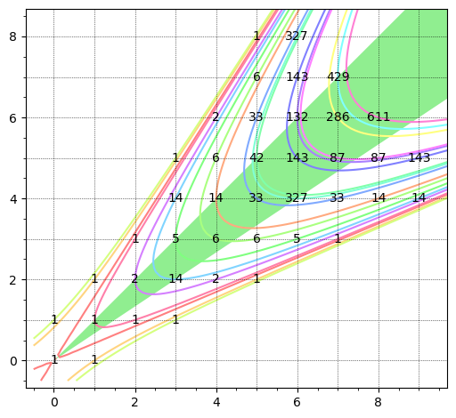

Code to compute the coefficients of the scattering terms in rank-2 cluster
scattering diagrams.

Example usage:

```
sage: %attach scatcoef.py
sage: var('a,b')
sage: (a, b)
sage: S = ScatteringCoefficients(a,b)
sage: S.compute_scattering_coefficients(4)
sage: S.c[2,1]
1/2*b*gcd(2*a, b) - 1/2*gcd(2*a, b)
sage: S = ScatteringCoefficients(2,3)
sage: S.compute_scattering_coefficients(10)
sage: S.c[4,6]
2
sage: S.show(15)
```

